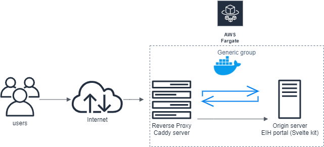

# S3 backend terraform lock storage and locking state in Dynamo DB

https://tanveer941.blogspot.com/2021/03/preserving-terraform-state.html

## Caddy
Caddy is a modern web server . Caddy is both a flexible, efficient static file server and a powerful, scalable reverse proxy.
One can use it as a dynamic reverse proxy to any number of backends, complete with active and passive health checks,
load balancing, circuit breaking, caching
Caddy runs great in containers because it has no dependencies.

## Block diagram for reverse proxy using Caddy

## [Caddy docker file elaboration](preserving_terraform_state/fargate_service/server/Dockerfile) - Overview
- Caddy is written in Go language.
- To build caddy plugins one needs xcaddy. There are two authentication plugins built via xcaddy and the output is a standalone executable
- A multi-layer strategy is used wherein pm2 is installed so that python flask server is run in the backend

## [Caddy file elaboration](preserving_terraform_state/fargate_service/server/Caddyfile) - Overview
- Caddy file has many directives like `route` which would route the requests in the path defined
- Reverse proxy is an important directive where in the incoming requests coming at port `5001` is directed to Flask server at port `5000`
- It would then fetch the necessary data and return to Caddy server which would then go back to the user
- Caddy would do the heavy lifting of performing certain activities like authentication, adding necessary headers to the request without modifying the existing code
- In this Caddy file example the two directives `auth` and `jwt` are configured to authenticate against Azure active directory
- One needs to replace the placeholder values `xxxAZURE_CLIENT_IDxxx` , `xxxAZURE_CLIENT_SECRETxxx` and `xxxAZURE_TENANT_IDxxx`
- OAuth2.0 authentication is done using the authorization code mechanism generating the jwt token

## [Running Flask and Caddy server](preserving_terraform_state/fargate_service/server/run_server.sh) - Overview
- pm2 is installed so that flask is run in the backend
- Then caddy is run after. Port 5001 is exposed as in the Dockerfile

## Docker build and run command to run in local
- Build the application code `docker build -t aplication_name:latest .`
- `docker run -ti --rm --entrypoint sh aplication_name:latest -c bash`
- `docker run -p 5001:5001 aplication_name:latest`
- Parallely in the other terminal run the command `Caddy run`

## When running in fargate port changes - explanation
- When running in fargate the port in [Dockerfile](preserving_terraform_state/fargate_service/server/Dockerfile) should be exposed to 80 instead of 5001
- When running in fargate the port in [runner.py](preserving_terraform_state/fargate_service/server/runner.py) should be exposed to 80 instead of 5001
- The primary container being run in ECS should always be exposed to 80 but when being run in windows locally port 80 is blocked